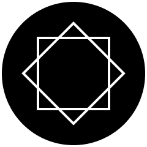

<p align="center">
  <a href="https://fonts.taedonn.com">
      
      <h1 align="center">Taedonn Portfolio</h1>
  </a>
  <p align="center">
    
    
    
  </p>
</p>

&nbsp;

## Intro
A simple next.js project to display and showcase my web development stacks.

Visit Website : https://taedonn.com

&nbsp;

## Dev goal

Welcome to my front-end developer portfolio website! Here, you'll find a showcase of my passion for creating engaging and user-friendly web experiences. Explore my projects, and discover how I transform concepts into digital reality. Join me on this creative journey and let's build the future of the web together.

&nbsp;

## packages & version

```
"dependencies": {
    "eslint": "8.40.0",
    "eslint-config-next": "13.4.1",
    "next": "13.4.3",
    "react": "18.2.0",
    "react-dom": "18.2.0",
    "tailwindcss": "^3.3.2",
    "typescript": "5.0.4"
}
```
